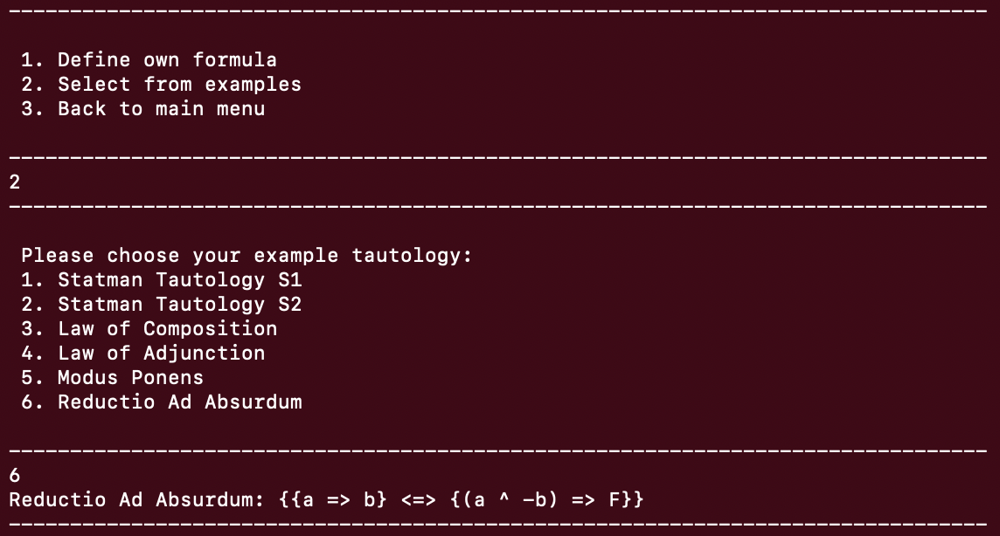

# Implementation of Deep Inference System SKS Theorem Prover in Haskell

## Overview
This project uses the Haskell programming language to implement a Theorem Prover for the classical propositional logic system SKS in deep inference. Deep inference is a methodology for designing proof theoretical formalisms, in which inference rules can be applied arbitrarily deeply inside the formula. The application features both Automated and Interactive Theorem Provers, designed to facilitate an understanding of proof theory, deep inference, and the construction of proof trees.

## Features

### User Interface
Command-line based interface for selecting built-in examples or inputting custom logical formulas.

- Main Interface


- Select Built in Examples 


- Input self-defined formulas


### Automated Proof Search
Uses search algorithms such as Breadth-First Search (BFS) and Depth-First Search (DFS) to construct bottom-up proof trees automatically.


### Interactive Proof Search 
A proof-assistant that enables step-by-step proof construction by user.


### Optimised Inference Rules and Search Methods
Adding constraints on inference rules and heuristics on search methods to reduce non-determinism and optimizing proof search.

## Key Concepts

### Deep Inference
Deep inference allows inference rules to be applied at any depth within logical formulas, offering:
- Locality: Reduces computational cost by enabling localized rule application.
- Duality: Ensures every rule has a corresponding dual.
- Atomicity: Ensures atoms can be followed throughout their lifecycle in proofs.

### System SKS
The system SKS is a calculus of structures designed for classical propositional logic. Its proof-theoretical features include rules like atomic identity, contraction, switch and medium rules.


## Prerequisites

This is a Haskell project that uses Cabal as the build system and package manager. Make sure you have the following installed on your local machine:

- [Haskell Platform](https://www.haskell.org/platform/)
- [Cabal](https://www.haskell.org/cabal/)
- [GHC](https://www.haskell.org/ghc/) (Glasgow Haskell Compiler)

You can verify the installation of Cabal and GHC by running:

```bash
cabal --version
ghc --version
```

## Getting Started
### Install dependencies:

Run the following command to install the necessary dependencies specified in the `.cabal` file:
```bash
cabal update
cabal install
```

### Build the project:

To compile the project, use:
```bash
cabal build
```

### Run the project:

To run the project, use:
```bash
cabal run
```

### Testing:
The unit testing of each inference rule was conducted with the HUnit framework, you can run it with
```bash
cabal test
```

## Project Structure

- `src/`: Contains the Haskell source code.
- `test/`: Contains the unit test file.
- `benchmark/`: Contains the benchmark file and previous raw data.
- `dist-newstyle/`: Output directory for compiled files.
- `System-SKS.cabal`: The Cabal configuration file, which defines the package, dependencies, and other settings.

## Cleaning Up

To clean up the build artifacts:

```bash
cabal clean
```

## Getting Started


### Install dependencies:

Run the following command to install the necessary dependencies specified in the `.cabal` file:

```bash
cabal update
cabal install
```

### Build the project:

To compile the project, use:

```bash
cabal build
```

### Run the project:

To run the project, use:

```bash
cabal run
```

### Testing:

If you have a test suite set up, you can run it with:

```bash
cabal test
```

## Project Structure

- `src/`: Contains the Haskell source code.
- `test/`: Contains the unit test file.
- `benchmark/`: Contains the benchmark file and previous raw data.
- `dist-newstyle/`: Output directory for compiled files.
- `System-SKS.cabal`: The Cabal configuration file, which defines the package, dependencies, and other settings.

## Cleaning Up

To clean up the build artifacts:

```bash
cabal clean
```